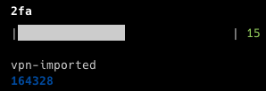

# 2fa-cmd

Google Authenticator or other OTP application in command.



## Install

```bash
$ git clone git@github.com:x-ray-s/2fa-cmd.git
$ cd 2fa-cmd
$ npm i && npm run build && npm link
```

## CLI

```
$ 2fa --help

	Usage
	  $ 2fa <input>

	Input
	  add - Add a new secret
	  remove - Remove a secret
	  verify - verify a token
	  import - Import a secret from url

	Options
		--name <The name of the secret>
		--secret <Your secret>
		--token <Your token>
		--url <The URL parsed by QR code exported from Google Authenticator>

	Examples
	  $ 2fa
	  $ 2fa add --name github --secret FCRJQZSGFD3VMZDE
	  $ 2fa remove --name github
	  $ 2fa verify --name github --token 643223
	  $ 2fa import --url 'otpauth://totp/...'
```

## TODO

- [] npm publish
- [] Sleep
- [] password
- [] encrypto
- [] custom storage path

## HOW

#### How to import Google Authenticator in command?

1. Open the Authenticator, Click Menu on left top;
2. Transform account and export accounts;
3. You will get a qrcode image;
4. Decode the qrcode. eg. [https://cli.im/deqr]()
5. You will get a schema URL like _otpauth-migration://offline?data=_
6. `2fa import --url '<your url>'` > notice the quotation mark
